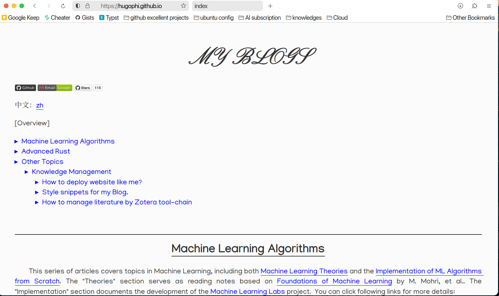
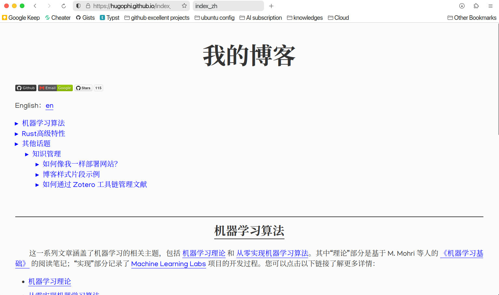

> 鉴于github page"令人惊叹"的部署速度，本项目已经迁移到新项目地址[hugophi/blog](https://github.com/HugoPhi/blog.git)

# My Bolgs

Link: [Yunming Hu's Blog](https://hugophi.github.io/)

## View

### 1. en



### 2. zh



## design

​ My blog depends on no code generator. What you should to is just write markdown files in typora and export them as index.html & index_zh.html under the path. For example, you want to write an article about PCA algorithm, this is steps you should do:

##### 1. create a folder to contain this article as a project

​ In my blog, an article is organized as a project that means you should put anything needed in your blog into its folder, and all of these folders are located in `$project/post/`. In this example, I name it `pca`:

```bash
mkdir ./post/pca
cd ./post/pca
```

##### 2. create index.md & edit it

​ After you get into project of this article, you can start writing your blog. If you want to use picture, you should put them into `$project/post/pca/asset/`.

##### 3. convert to index.html

​ After you ending editing, you should convert your index.md to index.html. I use the export function in **Typora**.

##### 4. refer it in top index.md

​ Then you can edit index.md under project root, refering this article in it. And convert index.md under project root to index.html.

##### 5. Multilingual support

​ You can create `index_xx.md` files for multilingual support, where `xx` represents your target language. For example, for Chinese: `index_zh.md`. Then, repeat steps 2 to 4. Additionally, you need to insert links to other language versions at the top of each `index` file. For instance, in the English `index.md`, you should insert:

```markdown
中文版：[zh](./index_zh.md)
```

and Iin the Chinese `index_zh.md`, you should insert:

```markdown
English: [en](./index.md)
```

Due to the structure of our organization, these lines are almost fixed. This is one of the reasons why I chose this structure—it’s somewhat similar to a B+ tree.

## Insight of Blog design

### How I structure the project?

​ Home page is editing in index.html under project root. And articles are located in `$project/post/`. All article is named as 'index\_\*.html', '\*' here is used to supprt multilingual versions. So you can refer all article easily. In each article folder, you can create anything of this article such as pictures, anmations and etc. without influnece the others.

### Where does the design of this style come from?

​ This style is inspired by this [website](https://sites.math.washington.edu//~morrow/mcm/mcm.html) & typora theme [Turing](https://theme.typora.io/theme/Turing/), which is in line with minimalist style. I will provide it in [index.css](./css/index.css) & [hugo](./css/hugo.css).
