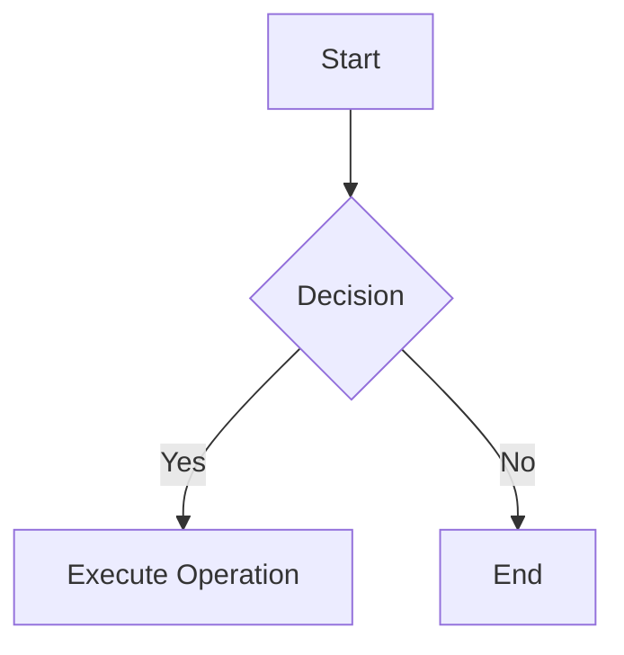
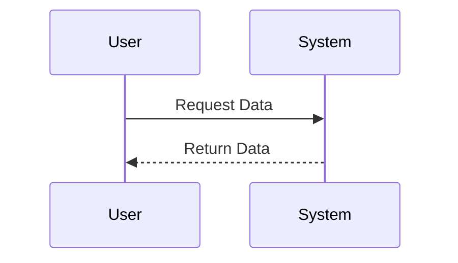
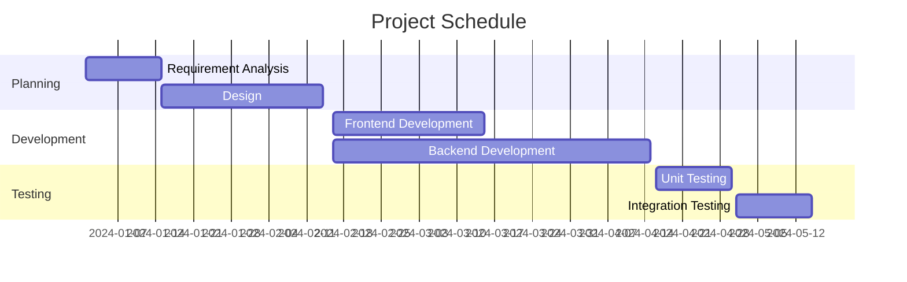

# Markdown Syntax Features Test

中文：[zh](./index_zh.html)

[TOC]


---


​	This test document is designed to demonstrate various Markdown syntax features, including basic formatting, lists, links, images, code blocks, tables, mathematical formulas, Mermaid diagrams, and more. This comprehensive test will help you verify the support of these features in different Markdown renderers.

## 1. Headings

# Heading Level 1
## Heading Level 2
### Heading Level 3
#### Heading Level 4
##### Heading Level 5
###### Heading Level 6

---

## 2. Text Formatting

**Bold Text**

*Italic Text*

***Bold and Italic Text***

~~Strikethrough Text~~

<u>Underlined Text</u> <!-- Note: Some renderers may not support underline -->

---

## 3. Lists

### Unordered List

- Item One
- Item Two
  - Subitem Two Point One
  - Subitem Two Point Two
- Item Three

### Ordered List

1. First Item
2. Second Item
   1. Subitem Two Point One
   2. Subitem Two Point Two
3. Third Item

### Task List

- [x] Complete Task One
- [ ] Complete Task Two
- [ ] Complete Task Three

---

## 4. Links and Images

### Links

This is an [example link](https://www.example.com).

### Images


> Note: Some renderers may require specific permissions to display external images.

---

## 5. Code

### Inline Code

Here is an example of `print("Hello, World!")`.

### Code Blocks

```python
def greet():
    print("Hello, World!")

greet()
```

```javascript
function greet() {
    console.log("Hello, World!");
}

greet();
```

---

## 6. Blockquotes

> This is a blockquote.
>
> It can span multiple lines.

---

## 7. Tables

| Name  | Age |
| ----- | --- |
| Alice | 25  |
| Bob   | 30  |
| Carol | 22  |

| Product | Price | Stock |
| ------- | ----- | ----- |
| Apple   | $1    | 100   |
| Banana  | $0.5  | 200   |
| Grape   | $2    | 150   |

---

## 8. Mathematical Formulas

### Inline Math

Einstein's mass-energy equivalence is $E = mc^2$.

### Block Math

$$
\int_{a}^{b} f(x) \,dx = F(b) - F(a)
$$

$$
\nabla \cdot \mathbf{E} = \frac{\rho}{\varepsilon_0}
$$

> Note: Rendering of mathematical formulas depends on whether the renderer supports LaTeX.

---

## 9. Mermaid Diagrams

### Flowchart



### Sequence Diagram



### Gantt Chart



> Note: Mermaid diagrams require the renderer to support Mermaid syntax.

---

## 10. Horizontal Rules

---

***

___

---

## 11. Others

### Text Alignment

Some renderers support text alignment:

Left Aligned (Defalut)

<center>Center Aligned</center> <!-- Not standard Markdown -->


<div align="right">Right Aligned</div> <!-- Using HTML -->

### Footnotes

This is a footnote example.[^1]

[^1]: This is the content of the footnote.

### Highlight

This is ==highlighted== text.

### Emoji

This is a smiley emoji 😊.

### Shortcodes

- \:smile:
- \:heart:
- \:rocket:

---

## 12. Unsupported Syntax Examples

### Inline HTML

<p style="color:red;">This is red text.</p>

### Custom Containers

::: warning
This is a warning box.
:::

### Nested Task Lists

- [x] Main Task
  - [x] Subtask One
  - [ ] Subtask Two

### LaTeX Macros

\newcommand{\vect}[1]{\boldsymbol{#1}}


